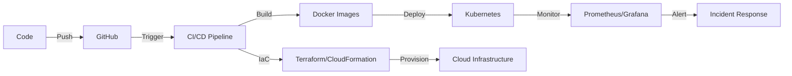

# 👋 Hi, I'm Mario Mafdy Habib

<div align="center">
  
[](https://git.io/typing-svg)

</div>

## 🚀 About Me

I'm a **Cloud DevSecOps Engineer** passionate about building scalable, secure, and automated infrastructure. Currently leading DevOps initiatives at **RockaiDev**, where I architect cloud-native solutions and streamline deployment pipelines.

- 🔭 Currently working on multi-cloud infrastructure automation
- 🌱 Deep diving into advanced Kubernetes patterns and GitOps
- 💡 Love transforming complex deployment challenges into elegant automated solutions
- 📍 Based in Cairo, Egypt (Ready to relocate)
- ⚡ Fun fact: Executed 100+ real-world DevOps scenarios on KodeKloud!

## 🛠️ Tech Stack

### ☁️ Cloud Platforms


### 🐳 Containers & Orchestration


### 🔄 CI/CD & Automation


### 📜 Infrastructure as Code


### 📊 Monitoring & Observability


### 💻 Languages & Scripting


### 🔧 Version Control & Tools


## 🏆 Certifications

- 🥇 **Oracle Cloud Infrastructure 2025 Certified Architect Associate**
- 🥇 **Oracle Cloud Infrastructure 2025 Certified Foundations Associate**
- 🎓 **HCIA-Cloud Computing v5**
- 🎓 **Advanced Cloud DevOps Nanodegree** (Udacity)
- 📜 **Reliable Google Cloud Infrastructure: Design and Process**
- 🐳 **Certified Kubernetes Administrator (CKA)** *(in progress)*

## 💼 Professional Highlights

```yaml
current_role:
  company: RockaiDev
  position: Mid-Senior DevOps Engineer
  responsibilities:
    - Leading full Cloud DevOps lifecycle
    - Designing multi-cloud infrastructure (AWS/GCP)
    - Building enterprise CI/CD pipelines
    - Orchestrating Kubernetes workloads (EKS/GKE)
    - Implementing DevSecOps best practices

achievements:
  - "Automated deployment cycles reducing release time by significant margins"
  - "Architected secure, cost-optimized cloud solutions"
  - "Implemented comprehensive monitoring with Prometheus & Grafana"
  - "Managed multi-tenant Kubernetes architectures"
```

## 🎯 Featured Projects

### 🚀 END TO END DEVOPS
Complete three-tier application deployment with full DevOps automation
- **Cloud**: AWS
- **Stack**: Docker, Kubernetes, Helm, Terraform, Ansible
- **CI/CD**: GitHub Actions
- **Monitoring**: Prometheus + Grafana

### 🔄 Auto-Deploy Application
Production-ready CI/CD pipeline with infrastructure automation
- **Tools**: CloudFormation, CircleCI, Ansible, Docker
- **Monitoring**: Prometheus + AlertManager
- **Focus**: Cost optimization, uptime monitoring, deployment efficiency

## 📈 GitHub Stats

<div align="center">
  


</div>

## 🌟 What I'm Working With



## 📫 Let's Connect!

<div align="center">

[](https://www.linkedin.com/in/mario-mafdy-/)
[](mailto:mariomafdy2@gmail.com)
[](https://github.com/mario-mafdy)

</div>

---

<div align="center">
  
### 💡 *"Automating today for a better tomorrow"*


</div>
